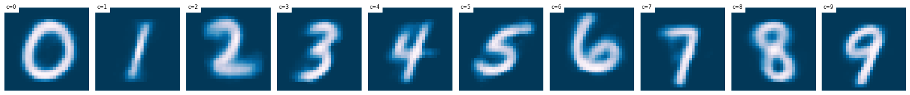
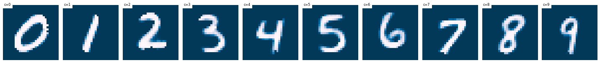
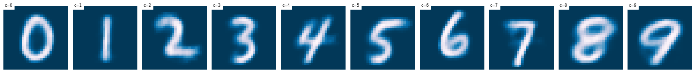

.. _inference:
.. sectionauthor:: Maxime Robeyns <maximerobeyns@gmail.com>

Inferring Galaxy Parameters
###########################

The original motivation behind the *AGNFinder* project was to speed up Bayesin
SED fitting.
MCMC approaches need to evaluate the likelihood term :math:`p(x \vert \theta)`
many times which is a slow process, dominated by the evaluation of the forward
model :math:`f : \Theta \to \mathcal{X}`. This is a mapping from physical galaxy
parameters :math:`\theta \in \Theta` (such as mass, star formation, E(B-V)
as well as AGN signatures such as AGN disc and torus, disk inclination and so
forth) to (mock) photometric observations :math:`x \in \mathcal{X}`.

To speed up the evaluation of the likelihood, we can *emulate* the forward model
with some function approximator (for instance a GP or a neural network). This is
the approach taken in Alsing *et al.* [SPEC2020]_, with good results, and was
incidentally the original goal of this project.

In this fork we take a slightly different approach to recovering physical
parameters from photometric observations :math:`p(\theta \vert x)`. We first
direct our attention away from emulating (and speeding up) the forward model,
and towards the main objective which is to recover the physical galaxy
parameters. We also eschew the MCMC methods used in this inference step in
favour of a variational Bayesian attack; namely a conditional variational
autoencoder [CVAE2015]_---a deep conditional generative model with latent
variables.

We motivate the use of this model by acknowledging that the low-dimensional
photometric observations (8 for the Euclid survey) are potentially weakly
predictive of the free galaxy parameters :math:`\theta`; particularly if
:math:`\theta` is relatively high dimensional. We are therefore trying to learn
a 'few-to-many' mapping where the conditional distribution :math:`p(\theta \vert
x)` is complicated and multi-modal.

If we were to use a discriminative model (such as a conventional feedforward
neural network, directly learning the mapping :math:`f: \mathcal{X} \to \Theta`)
then we would merely be making use of *correlations* in the dataset of simulated
:math:`(\theta, x)` pairs; :math:`\mathcal{D} = \{(\theta_{i},
x_{i})\}_{i=1}^{n}` to make predictions.

Attempting to model the generative process by using a CVAE may allow us to
uncover causal relations in an unsupervised manner [IVAE2019]_, using only the
simulated dataset :math:`\mathcal{D}`. This may make this approach more robust
to extrapolation, and use in different surveys.

..
    A generative model on the other hand learns the distribution of the
    predictor and response jointly; that is:

    .. math::

        p(\mathcal{D}) \stackrel{iid.}{=} \prod_{i=1}^{n}p(x_{i}, \theta_{i}).

    Drawing samples from this (learned) data distribution :math:`p(\mathcal{D})`
    would yield plausible-looking galaxy photometry along with their physical
    parameters.

    To recover a discriminative model :math:`p(\theta \vert x)`, we apply Bayes
    rule, and optimise the evidence lower bound (ELBO) as a substitute for
    evaluating the generally intractable marginal likelihood or *evidence* term in
    the denominator.

(Conditional) Variational Autoencoders
--------------------------------------

.. note:: To avoid a clash of notation, we will henceforth denote the physical
   galaxy parameters as :math:`y` (previously :math:`\theta`). This matches
   the machine learning nomenclature of denoting outputs to be predicted as
   :math:`y`, and model parameters as :math:`\theta`.

Latent Variable Models
~~~~~~~~~~~~~~~~~~~~~~

A variational autoencoder (VAE) is an example of a *latent variable model*
(LVM). Latent variables, often denoted :math:`z`, are unobserved variables which
ideally represent some disentangled, semantically meaningful, and statistically
independent causal factors for variation in the data.

A latent variable model (LVM) is a distribution over the data we care about and
the latent variables :math:`p(y, z)`. We can factorise this in two ways: either
working with the posterior :math:`p(z \vert y)` to, perhaps stochastically,
map (or *encode*) a datapoint :math:`y` to its latent representation :math:`z`,
or the posterior :math:`p(y \vert z)` to generate (or *decode* latents :math:`z`
to) new plausible :math:`y` samples.

In the second factorisation :math:`p(y, z) = p(y \vert z) p(z)`, the LVM takes
the form of

.. math::
   \begin{align*}
   p_{\theta_{z}}(z) &= f_{z}(z; \theta_{z}) \\
   p_{\theta_{y}}(y \vert z) &= f_{y}(y; z, \theta_{y}),
   \end{align*}

where :math:`f_{z}` and :math:`f_{y}` are valid density functions, and
:math:`\theta = \{\theta_{z}, \theta_{y}\}` parametrises the generative process.
To sample from :math:`p_{\theta_{y}}(y \vert z)` we first sample from the
prior over the latent variables :math:`\hat{z} \sim p_{\theta_{z}}(z)`, and
condition on this :math:`\hat{y} \sim p_{\theta_{y}}(y \vert \hat{z})`. In
practice we use neural networks to parametrise :math:`f_{z}` and :math:`f_{y}`.

We could train this model by maximising the log marginal likelihood
:math:`\log p(y)`, which we may interpret as minimising some distance measure
:math:`D\big[p_{\theta}(y) \Vert p^{*}(y)\big]` between our model
:math:`p_{\theta}(y)` and the true data distribution :math:`p^{*}(y)` (i.e. a
mixture of Diracs; one for each point in the training dataset).

Since we are interested in inferring galaxy parameters :math:`y` *given* some
photometric observation :math:`x`, we can extend this idea to a *conditional* VAE,
where we are now after :math:`p_{\theta}(y \vert x) \approx p^{*}(y \vert x)`;
or equivalently minimising :math:`D\big[p_{\theta}(y \vert x) \Vert p^{*}(y
\vert x)\big]`.

..
    .. math::

        p_{\theta}(y \vert x) \approx p^{*}(y \vert x) \stackrel{iid.}{=}
        \prod_{(y', x') \in \mathcal{D}} p^{*}(y' \vert x').

A *conditional* latent variable model is a joint distribution over both some data
:math:`y` and the latent variables :math:`z`, conditioned on some context
:math:`x`; :math:`p(y, z \vert x) = p(y \vert z, x)p(z \vert x)`---in this
application :math:`y` are the physical galaxy parameters, and :math:`x` are the
photometric observations. By analogy to the above, the conditional latent
variable model is of the form

.. math::
   \begin{align*}
   p_{\theta_{z}}(z \vert x) &= f_{z}(z; x, \theta_{z}) \\
   p_{\theta_{y}}(y \vert z, x) &= f_{y}(y; z, x, \theta_{y}).
   \end{align*}

Thus we first condition the distribution over the latent variable :math:`z` on
the photometric observations :math:`x`. In turn, we condition the distribution
over the physical galaxy parameters :math:`y` on both the (conditional) latent
samples and the photometric observations.

As above, our objective is to find some :math:`\theta \in \Theta` such that
:math:`p_{\theta}(y \vert x) \approx p^{*}(y \vert x)`, and this can be acheived
by maximising the (log) marginal likelihood of the :math:`N` training observations
under our model:

.. math::
   :label: LVMObjective

    \underset{\theta \in \Theta}{\mathrm{argmax}}
    \sum_{i=1}^{N} \log p_{\theta}(y_{i} \vert x_{i})
    =
    \underset{\theta \in \Theta}{\mathrm{argmax}}
    \sum_{i=1}^{N} \log \int_{\mathcal{Z}} p_{\theta}(y_{i} \vert z, x_{i}) dz.

Integrating out the latent variable from the LVM :math:`p_{\theta}(y \vert z,
x)` to find the marginal likelihood (or *model evidence*) is often intractable.
Taking the variational Bayesian approach, we instead optimise a lower-bound on
this intractable model evidence, referred to as the *evidence lower bound*
(ELBO).

..
    Here we introduce an approximate posterior distribution over the latent
    variables :math:`q_{\phi}(z \vert y, x) \approx p_{\theta}(z \vert x)`, which is
    parametrised by :math:`\phi` and should be convenient to sample from.

LVM Objective
~~~~~~~~~~~~~

We will derive this lower bound twice, to appreciate two different intuitions.
While we use the conditional form of the VAE throughout---which is certainly
more verbose than the vanilla VAE derivations---I think that the consistency
with later sections as well as the accompanying codebase justifies this.

Beginning with the importance sampling perspective, we ideally want to take a
Monte Carlo approximation to the integral in :eq:`LVMObjective`. Unfortunately
for most :math:`z`, :math:`p_{\theta}(y \vert z, x)` is likely to be close to
zero. Rather than taking the expectation uniformly over :math:`z`, we instead
take it over a 'proposal distribution' :math:`q_{\phi}(z \vert y, x)`. We want
samples of :math:`z \sim q_{\phi}(z \vert y, x)` to be likely to have produced
:math:`y`; that is, to give non-zero :math:`p(y \vert z, x)` for :math:`(x, y)`
in the training data, so that we can approximate the integral with fewer
samples.

Taking the expectation wrt. the proposal distribution :math:`q_{\phi}(z \vert y,
x)` on both sides of :eq:`LVMObjective` (first line below), and introducing
:math:`q_{\phi}` on the right hand side as a ratio of itself (second line) while
applying Bayes rule to rearrange :math:`p_{\theta}(y \vert z, x)` (also second
line) gives:

.. math::
   \log p_{\theta}(y \vert x) &=
   \int_{\mathcal{Z}} q_{\phi}(z \vert y, x) \log p_{\theta}(y \vert z, x)dz \\
   &= \int_{\mathcal{Z}} q_{\phi}(z \vert y, x) \left(
   \log \frac{p_{\theta}(y, z \vert x)}{q_{\phi}(z \vert y, x)} +
   \log \frac{q_{\phi}(z \vert y, x)}{p_{\theta}(z \vert x)}
   \right) dz \\
   &= \underbrace{\mathbb{E}_{q_{\phi}(z \vert y, x)}\left[
   \log p_{\theta}(y, z \vert x) - \log q_{\phi}(z \vert y, x)
   \right]}_{\text{variational lower-bound, } \mathcal{L}(\theta, \phi; x, y)} +
   D_{\text{KL}}\left[q_{\phi}(z \vert y, x) \Vert p_{\theta}(z \vert x)\right].

Since the KL divergence is non-negative, the :math:`\mathcal{L}(\theta, \phi; x,
y)` term indeed lower-bounds the evidence:

.. math::

   \log p_{\theta}(y \vert x) &\ge
   \mathbb{E}_{q_{\phi}(z \vert y, x)} \left[
    \log p_{\theta}(y \vert z, x) + \log p_{\theta}(z \vert x) -
    \log q_{\phi}(z \vert y, x) \right] \\
   &= \mathbb{E}_{q_{\phi}(z \vert y, x)}\left[
    \log p_{\theta}(y \vert z, x)
    \right] + \int_{\mathcal{Z}} q_{\phi}(z \vert y, x) \log
    \frac{p_{\theta}(z \vert x)}{q_{\phi}(z \vert y, x)} dz \\
     &= \mathbb{E}_{q_{\phi}(z \vert y, x)}\left[\log p_{\theta}(y \vert z, x)\right]
     - D_{\text{KL}}\left[q_{\phi}(z \vert y, x) \Vert p_{\theta}(z \vert x)\right].

This last line above is the canonical form in which the ELBO is usually
given.

--------------------------------------------------------------------------------

.. sidebar:: Jensen's inequality

    .. image:: ./_static/jensens-inequality.svg

    Put loosely, Jensen's inequality states that :math:`\varphi(\mathbb{E}[x])
    \ge \mathbb{E}[\varphi(x)]`, for :math:`\varphi(\cdot)` a concave function
    e.g. :math:`log(\cdot)`.

For another perspective, we may derive the lower bound using Jensen's
inequality.

In the first line below, we explicitly write the marginalisation
over the latents :math:`z`, and we also introduce the encoder or *recognition
model* :math:`q_{\phi}(z \vert y, x)` as a ratio of itself. On the second line,
we use Jensen's inequality to push the logarithm (a concave function) inside the
expectation and introduce the lower bound:

.. math::

   \log p_{\theta}(y \vert x) &=
   \log \int_{\mathcal{Z}} p_{\theta}(y, z \vert x)
   \frac{q_{\phi}(z \vert y, x)}{q_{\phi}(z \vert y, x)} dz \\
   &\ge \int_{\mathcal{Z}}q_{\phi}(z \vert y, x)\big(\log p_{\theta}(y, z \vert x)
   - \log q_{\phi}(z \vert y, x)\big) dz \\
     &= \mathbb{E}_{q_{\phi}(z \vert y, x)}\left[\log p_{\theta}(y, z \vert x) -
     \log q_{\phi}(z \vert y, x)\right] \\
     &\doteq \mathcal{L}(\theta, \phi; x, y).

We can now perform the same rearrangements as above on
:math:`\mathcal{L}(\theta, \phi; x, y)` to reach the canonical form for the ELBO
objective that we try to maximise which, for completeness, is

.. math::

    \mathcal{L}_{\text{CVAE}}(\theta, \phi; x, y) =
    \mathbb{E}_{q_{\phi}(z \vert y, x)}\left[\log p_{\theta}(y \vert z, x)\right]
     - D_{\text{KL}}\left[q_{\phi}(z \vert y, x) \Vert p_{\theta}(z \vert x)\right]

From the above, we can see that the ELBO optimises two quantities that we care
about concurrently:

1. We (approximately) maximise the marginal likelihood, since
   :math:`\mathbb{E}_{q_{\phi}(z \vert y, x)}\left[\log p_{\theta}(y \vert z,
   x)\right] = \log p_{\theta}(y \vert x)`, which makes our generative model
   better.
2. We make the approximate posterior :math:`q_{\phi}(z \vert y, x)` more similar
   to the true posterior :math:`p_{\theta}(z \vert x)`; making the recognition
   model better.

SGD ELBO Optimisation
~~~~~~~~~~~~~~~~~~~~~

We wish to optimise this ELBO objective over both :math:`\theta` and
:math:`\phi`. While the gradient :math:`\nabla_{\theta, \phi}\mathcal{L}(\theta,
\phi; y, x)` is in general intractable, we can use Monte Carlo approximations as
well as the 'reparametrisation trick' to obtain a good unbiased estimator
:math:`\tilde{\nabla}_{\theta, \phi}\mathcal{L}(\theta, \phi; y, x)`.

The derivative wrt. :math:`\theta` can be straightforwardly obtained with a
Monte Carlo approximation of the expectation:

.. math::

   \nabla_{\theta}\mathcal{L}(\theta, \phi; y, x) &=
   \mathbb{E}_{q_{\phi}(z \vert y, x)}\left[
   \nabla_{\theta}\big(\log p_{\theta}(y, z \vert x) -
   \log q_{\phi}(z \vert y, x)\big) \right] \\
   &\approx \frac{1}{K}\sum_{i=1}^{K} \nabla_{\theta}
   \log p_{\theta}(y, z \vert x)

However, when trying to get unbiased gradients of the ELBO wrt. the variational
parameters :math:`\nabla_{\phi}\mathcal{L}(\theta, \phi; y, x)`, we can no
longer commute the derivative with the expectation:
:math:`\nabla_{\phi}\mathbb{E}_{q_{\phi}(z \vert y, x)}[f(x, y, z)] \ne
\mathbb{E}_{q_{\phi}(z \vert y, x)}[\nabla_{\phi}f(x, y, z)]`. We resolve to
apply the change of variables formula for probability distributions (also called
the *reparametrisation trick*), which will result in:

.. math::

   \nabla_{\phi}\mathbb{E}_{q_{\phi}(z \vert y, x)}[f(x, y, z)] &=
   \mathbb{E}_{p(\epsilon)}\big[\nabla_{\phi}f\big(x, y, g(\phi, y, x,
   \epsilon)\big)\big] \\
   &\approx \frac{1}{K}\sum_{i=1}^{K} \nabla_{\phi} f\big(x, y, z^{(i)}\big),
   \hspace{0.5cm} z^{(i)} = g(\phi, y, x, \epsilon),

where :math:`g(\cdot)` is an invertible and differentiable function, and
:math:`p(\epsilon)` is a fixed density (e.g. a standard Gaussian) which we
can easily sample from.

While it is straightforward to generate reparametrised samples from
:math:`q_{\phi}(z \vert y, x)` (we just evaluate :math:`g(\phi, \epsilon', y,
x)` for some :math:`\epsilon' \sim p(\epsilon)`), it is slightly more
complicated to evaluate the density of some :math:`z` under this posterior
distribution, which is given by

.. math::

   \log q_{\phi}(z \vert y, x) = \log p(\epsilon) - \log \left\vert \det
   \frac{\partial g_{\phi}}{\partial\epsilon}(y, x, \epsilon)\right\vert,

We must subtract the log of the determinant of the Jacobian
:math:`\frac{\partial z}{\partial \epsilon}` in order to conserve unit probability
mass before and after the transformation :math:`g`. It follows that we would
like to select (flexible) transformations :math:`g` where the log determinant of
the Jacobian term is cheap to compute.

--------------------------------------------------------------------------------

**Factorised Gaussian Encoder**

A good first attempt at specifying the form for :math:`q_{\phi}(z \vert y, x)`
might be to use an isotropic Gaussian. That is, :math:`q_{\phi}(z \vert y, x) =
\mathcal{N}\big(z; \mu, \text{diag}(\sigma^2)\big)`, where the parameters of
this Gaussian :math:`(\mu, \log \sigma)` are the outputs of the encoder network.
Hence we may draw samples from :math:`q_{\phi}(z \vert y, x)` as follows:

.. math::

   \epsilon &\sim \mathcal{N}(0, \mathbf{I}) \\
   (\mu, \log \sigma) &= f_{\text{enc}}(\phi, y, x) \\
   z &= \mu + \sigma \odot \epsilon

where :math:`\odot` represents an element-wise product and
:math:`f_{\text{enc}}` is the '*encoder*' neural network.

To evaluate the density of some :math:`z` under this distribution, we first find
the Jacobian of this transformation, which in this isotropic Gaussian case is
:math:`\frac{\partial z}{\partial \epsilon} = \text{diag}(\sigma)`. The
determinant of a diagonal matrix is merely the product of the diagonal terms, so
we may compute the log determinant of the Jacobian in :math:`O(n)` time as:

.. math::

   \log \left\vert \det \frac{\partial z}{\partial \epsilon} \right\vert =
   \sum_{i=1}^{n}\log \sigma_{i},

where :math:`n` is the dimensionality of the latent space. Since :math:`q` is
isotropic Gaussian, we may find the density of a latent vector as a product of
univariate Gaussians: :math:`q_{\phi}(z \vert y, x) =
\prod_{i=1}^{n}\mathcal{N}(z_{i}; \mu_{i}, \sigma_{i})`, and so the posterior density
can be expressed as a single sum and evaluated in linear time:

.. math::

   \log q_{\phi}(z \vert y, x) &= \sum_{i=1}^{n} \log \mathcal{N}(\epsilon_{i};
   0, 1) - \log \sigma_{i} \\
   &= -\sum_{i=1}^{n}\frac{1}{2} \big(\log (2\pi) + \epsilon_{i}^2\big) +
   \log \sigma_{i},

when :math:`z = g(\phi, \epsilon, y, x)`.

--------------------------------------------------------------------------------

**Full Covariance Gaussian Encoder**

A more flexible inference model :math:`q_{\phi}(z \vert y, x)` will generally
improve the tightness of the ELBO (since the KL divergence term
:math:`D_{\text{KL}}\big[q_{\phi}(z \vert y, x) \Vert p_{\theta}(z \vert x)]`,
which introduces the inequality, will be smaller). We must maintain an efficient
sampling procedure (e.g. reparametrised sampling, for which it must remain cheap
to evaluate the log determinant of the Jacobian). A full-covariance Gaussian
satisfies these desiderata; where :math:`q_{\phi}(z \vert y, x) = \mathcal{N}(z;
\mu, \Sigma)`, and :math:`(\mu, \Sigma) = f_{\text{enc}}(\phi, y, x)` is a
neural network.

The reparametrised sampling procedure is:

.. math::

   \epsilon &\sim \mathcal{N}(0, \mathbf{I}) \\
   z &= \mu + L\epsilon

where L is a lower triangular matrix with non-zero diagonal elements. The reason
for this constraint is that it makes the evaluating the density of
:math:`q_{\phi}(z \vert y, x)`, which in turn requires finding the log
determinant of the Jacobian of the above simple.  The Jacobian is
:math:`\frac{\partial z}{\partial \epsilon} = L`, and since the determinant of a
triangular matrix is the product of the diagonal elements, we get:

.. math::

   \log \left\vert \det \frac{\partial z}{\partial \epsilon} \right\vert =
   \sum_{i=1}^{n} \log \vert L_{ii} \vert

As an implementation point, we can output a matrix :math:`L` with the desired
properties from a neural network by constructing it as:

.. math::

   (\mu, \log \sigma, L') &= f_{\text{enc}}(\phi, y, x) \\
   L &= L_{\text{mask}} \odot L' + \text{diag}(\sigma),

where :math:`L_{\text{mask}}` is a masking matrix with zeros on and above the
diagonal, and ones below the diagonal. This ensures that :math:`L` is
triangular, with :math:`\sigma` on the diagonal. We therefore recover the same
log-determinant as the isotropic Gaussian case:

.. math::

   \log \left\vert \det \frac{\partial z}{\partial \epsilon} \right\vert =
   \sum_{i=1}^{n} \log \sigma_{i}

and therefore evaluating the density proceeds exactly as before:

.. math::

   \log q_{\phi}(z \vert y, x) = -\sum_{i=1}^{n}\frac{1}{2} \big(\log (2\pi) +
   \epsilon_{i}^2\big) + \log \sigma_{i}.

.. todo:: Discuss approaches using normalising flows for the inference model,
          such as Normalising Flows or Inverse Autoregressive Flows.

          Note that the Normalising Flows approach is in theory a straightforward
          repetition of the full-covariance Gaussian approach outlined above.

Likelihood
----------

We have yet to specify a form for :math:`p`. Recall that in our conditional LVM,
the marginal likelihood is found by marginalising out the latent variable

.. math::

   p_{\theta}(y \vert x) = \int_{\mathcal{Z}}p_{\theta}(y, z \vert x) dz.

If we have a Gaussian likelihood :math:`p_{\theta}(y \vert z, x) =
\mathcal{N}\big(y; \mu_{\theta}(z, x), \Sigma_{\theta}(z, x)\big)`, then the
above is a Gaussian mixture model: for discrete :math:`z` with :math:`K`
possible values, then there are :math:`K` components, while for continuous
:math:`z` this is an infinite mixture, which can be very flexible.

The likelihood needn't be Gaussian however; for instance for binary MNIST images
we might choose instead to use a (factorised) Bernoulli likelihood. We could
even use a Laplace likelihood which would model something like the 'median'
digit image; resulting in sharper images---although this is perhaps a little
unwise for it incurs a higher test log likelihood (due to a lower variety) and
it's certainly unusual.

For fun, here is a comparison of some images sampled from the posterior
:math:`p(y \vert z, x)` for various likelihoods, where the CVAE was trained on
the MNIST handwritten digit dataset in ``/notebooks/VAE/basic_vae.ipynb``. (This
is good for building intuition; we can immediately tell when a digit 'looks
right', but we might not all have the same intuitions for galaxy parameters...)

*Gaussian likelihood:*

*Laplace likelihood:*

*Bernoulli likelihood:*

Implementation
--------------

We now have all the components we need to actually optimise the ELBO using SGD.
We can re-arrange the ELBO as

.. math::

    \mathcal{L}_{\text{CVAE}}(\theta, \phi; x, y) &=
    \mathbb{E}_{q_{\phi}(z \vert y, x)}\left[\log p_{\theta}(y \vert z, x)\right]
     - D_{\text{KL}}\left[q_{\phi}(z \vert y, x) \Vert p_{\theta}(z \vert x)\right] \\
       &= \mathbb{E}_{q_{\phi}(z \vert y, x)}\big[\log p_{\theta}(y \vert z, x) +
       \log p_{\theta}(z \vert x) - \log q_{\phi}(z \vert y, x)\big] \\
       &\doteq \mathbb{E}\big[\mathcal{L}_{\text{logpy}} +
       \mathcal{L}_{\text{logpz}} - \mathcal{L}_{\text{logqz}} \big]

We have already derived the expression for evaluating :math:`\log q_{\phi}(z
\vert y, x)`:

.. math::

    \mathcal{L}_{\text{logqz}} = -\sum_{i=1}^{n}\frac{1}{2} \big(\log (2\pi) +
    \epsilon_{i}^2\big) + \log \sigma_{i},

where :math:`z \in \mathbb{R}^{n}`.

In conditional LVMs, some authors choose to sample :math:`z` independently
of the conditioning information :math:`x` at test time, and they do so with a
standard Gaussian for the prior density :math:`p(z \vert x) = \mathcal{N}(z; 0,
\mathbf{I})`. For this application however, conditioning the latent variable at
test time on the photometric observations seems sensible. If we use an
isotropic Gaussian distribution (to match our :math:`q` distribution), then we
get

.. math::

    (\mu, \log \sigma) &= f_{\text{prior}}(\theta_{z}, x) \\
    \mathcal{L}_{\text{logpz}} &= \log p(z \vert x) =
    \sum_{i=1}^{n} \log \mathcal{N}(z_{i}; \mu_{i}, \sigma_{i}) \\
    &= - \sum_{i=1}^{n} \frac{1}{2} \left(\log (2\pi\sigma_{i}^2) +
    \big(z_{i} - \mu_{i})^{2}\sigma_{i}^{-2}\big)\right).

Once again, in the above :math:`n` is the dimension of the latent vector
:math:`z \in \mathbb{R}^{n}`.

Finally for the log likelihood term :math:`\mathcal{L}_{\text{logpy}}`, we
merely evaluate the likelihood of the :math:`y` training datapoint under the
appropriate density. Be mindful that this step is prone to be slow; particularly
if one naively chooses something like a full multivariate Gaussian likelihood,
where evaluating the log probability will involve Cholesky decompositions to
invert the covariance matrix. As a rule of thumb, factorising this distribution
should be sufficient to keep things speedy.

For expedience and convenience, it can be useful to use the analagous loss
function for your chosen likelihood; for instance the mean squared error for a
Gaussian likelihood, binary cross-entropy for a Bernoulli likelihood, L1
(mean absolute error) loss for a Laplace likelihood and so on. Just remember to
negate it before using it in the ELBO!

Also note that these loss functions may only represent the negative log
likelihood up to proportionality; this implicit scaling of the likelihood term
relative to the KL divergence term in the ELBO might result in inadvertently
'tempering the posterior', which is where we scale the KL divergence by some
:math:`\lambda < 1`:

.. math::

    \mathcal{L}_{\text{CVAE}}(\theta, \phi; x, y) =
    \mathbb{E}_{q_{\phi}(z \vert y, x)}\left[\log p_{\theta}(y \vert z, x)\right]
     - \lambda D_{\text{KL}}\left[q_{\phi}(z \vert y, x) \Vert p_{\theta}(z \vert x)\right].

In the context of VAEs, this is often done intentionally as an implementation
detail, where it is referred to as 'warming up the KL term' [LVAE2016]_.
Here, :math:`\lambda` is annealed from 0 to 1 at the beginning of
training---without this, the 'variational regularisation term' (read, KL divergence
term) causes the latents in :math:`q` to be drawn towards their own prior, which
leads to uninformative latents which the optimisation algorithm is not able to
re-activate later in training.

-------------------------------------------------------------------------------

There are a fair number of moving parts involved with implementing a CVAE. For
convenience I have tried to abstract away the common code into a base ``CVAE``
class, so as to offer a framework with which to implement variations on the
(C)VAE described above.

Architecture Description
~~~~~~~~~~~~~~~~~~~~~~~~

To implement a CVAE, we have three networks;

- the recognition or *encoder* network :math:`q_{\phi}(z \vert y, x)`,
- the (conditional) prior network :math:`p_{\theta}(z \vert x)`
- the generation or *decoder* network :math:`p_{\theta}(y \vert z, x)`

Implementation begins in the ``config.py`` file, where the neural network
architectures for each of the above may be described by an instance of an
``arch_t`` class. These are passed to the constructor of the ``CVAE`` base class
for you, where the corresponding networks will be initialised.

The constructor of the ``arch_t`` class has the following signature::

    def __init__(self, layer_sizes: list[int], head_sizes: list[int],
                 activations: Union[nn.Module, list[nn.Module]],
                 head_activations: Optional[list[Optional[nn.Module]]] = None,
                 batch_norm: bool = True):
         pass

and as a generic example, you could use it as follows::

    >>> arch_t(layer_sizes=[28*28, 256], head_sizes=[10, 2], \
    ...        activations=nn.ReLU(), \
    ...        head_activations=[nn.Softmax(), None] \
    ...        batch_norm=False)

For a CVAE-specific example, here are some networks that you might use for
MNIST::

    # Gaussian recognition model q_{phi}(z | y, x)
    recognition_arch: arch_t = arch_t(
            [data_dim + cond_dim, 256], [latent_dim, latent_dim], nn.ReLU())

    # Gaussian prior network p_{theta}(z | x)
    prior_arch: arch_t(
        [cond_dim, 256], [latent_dim, latent_dim], nn.ReLU(), batch_norm=False)

    # generator network arch: p_{theta}(y | z, x)
    generator_arch: arch_t = arch_t(
        [latent_dim + cond_dim, 256], [data_dim, data_dim], nn.ReLU(),
        [nn.Sigmoid(), None])

CVAE Implementation
~~~~~~~~~~~~~~~~~~~

The base ``CVAE`` class has a number of abstract methods, which should hopefully
be useful in guiding new CVAE implementations by providing a 'checklist' of
methods to implement. These abstract methods are:

1. **preprocess**

   The ``preprocess`` method has the following signature::

        def preprocess(self, x: Tensor, y: Tensor) -> tuple[Tensor, Tensor]

   This allows you to apply any required transformations, and send the data to a
   particular device before the training process.

2. **recognition_params**

   This method is used to return the parameters which are later used to perform
   reparametrised sampling. For example, if :math:`q` is isotropic Gaussian,
   then you should calculate and return the mean and diagonal covariance. The
   signature is::

    def recognition_params(self, y: Tensor, x: Tensor) -> DistParam

   Note that ``DistParam`` is an alias for ``list[Tensor]``.

3. **prior**

   This method returns the prior distribution---you do not have to use the
   provided ``x`` tensor. The signature is::

    prior(self, x: Tensor) -> Distribution

   where ``Distribution`` is an alias for the base PyTorch distribution class.

4. **generator**

   Similar to the above, except now we are returning the 'generator'
   distribution. The signature is::

    generator(self, z: Tensor, x: Tensor) -> Distribution

5. **rsample**

   Performs reparametrised sampling. You usually call ``recognition_params`` as
   a first step, and also sample some :math:`\hat{\epsilon} \sim p(\epsilon)`.

   For convenience, the ``CVAE`` base class provides a ``self.EKS(batch_shape: int)``
   callable, which samples a ``[batch_shape, latent_dim]`` tensor from a
   standard Gaussian.

   The signature of ``rsample`` is as follows::

    rsample(self, y: Tensor, x: Tensor) -> tuple[Tensor, DistParam]

   The returned the ``DistParams`` are passed into the ``kl_div`` method
   (below), and by convention should include the sampled :math:`\epsilon` term
   at index 0.

6. **kl_div**

   This final abstract method returns the KL divergence term in the ELBO. It is
   provided with ``z`` the latent vector obtained from ``rsample``, ``x`` the
   conditioning information and ``rparams`` which was returned from ``rsample``.

   The full signature is::

    def kl_div(self, z: Tensor, x: Tensor, rparams: DistParam) -> Tensor

For more descriptions and details on the workings of the ``CVAE`` base class,
please see ``/agnfinder/inference/base.py``.

References
----------

.. [CVAE2015] Sohn, Kihyuk, Honglak Lee, and Xinchen Yan. ‘Learning Structured
   Output Representation Using Deep Conditional Generative Models’. In Advances
   in Neural Information Processing Systems, Vol. 28. Curran Associates, Inc.,
   2015. https://proceedings.neurips.cc/paper/2015/hash/8d55a249e6baa5c06772297520da2051-Abstract.html.

.. [SPEC2020] Alsing Justin, Hiranya Peiris, Joel Leja, ChangHoon Hahn, Rita
   Tojeiro, Daniel Mortlock, Boris Leistedt, Benjamin D. Johnson, and Charlie
   Conroy. ‘SPECULATOR: Emulating Stellar Population Synthesis for Fast and
   Accurate Galaxy Spectra and Photometry’. The Astrophysical Journal Supplement
   Series 249, no. 1 (26 June 2020): 5.
   https://doi.org/10.3847/1538-4365/ab917f.

.. [IVAE2019] Kingma, Diederik P., and Max Welling. ‘An Introduction to
   Variational Autoencoders’. Foundations and Trends® in Machine Learning 12,
   no. 4 (2019): 307–92. https://doi.org/10.1561/2200000056.

.. [LVAE2016] Sønderby, Casper Kaae, Tapani Raiko, Lars Maaløe, Søren Kaae
   Sønderby, and Ole Winther. ‘Ladder Variational Autoencoders’. In Advances in
   Neural Information Processing Systems, Vol. 29. Curran Associates, Inc.,
   2016.
   https://papers.nips.cc/paper/2016/hash/6ae07dcb33ec3b7c814df797cbda0f87-Abstract.html.

