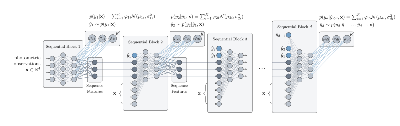
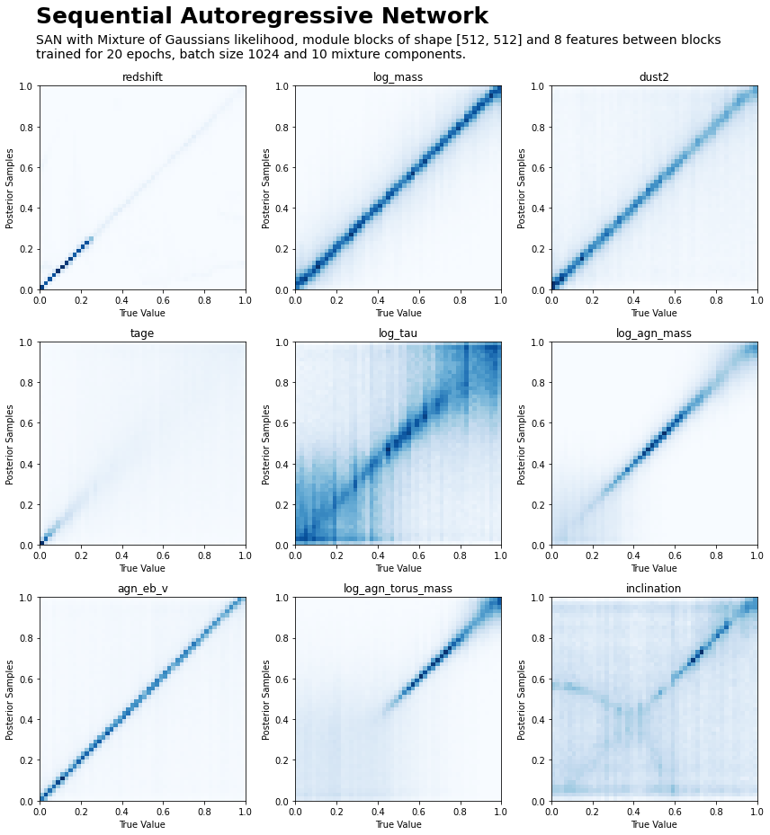

.. _san_inference:
.. sectionauthor:: Maxime Robeyns <maximerobeyns@gmail.com>

Inferring Galaxy Parameters (SAN)
#################################

The method described in this page, the *Sequential Autoregressive Network*,
(SAN) is currently the best performing method in the codebase.
As a reminder, we wish to estimate the distribution of physical galaxy
parameters :math:`\mathbf{y} \in \mathbb{R}^{9}`, given some photometric
observations :math:`\mathbf{x} \in \mathbb{R}^{8}`; that is :math:`p(\mathbf{y}
\vert \mathbf{x})`.

We draw loose inspiration from other autoregressive models such as [MADE2015]_,
while focusing on the goals of providing fast sampling times (i.e. being able to
compute the distribution of :math:`p(\mathbf{y} \vert \mathbf{x})` quickly as
well as being able to draw samples from it quickly) and maintaining good accuracy;
that is, we hope for low test NLL, :math:`-\sum^N_{i=1} \log
p_{\text{SAN}}(\mathbf{y}_{i}\vert \mathbf{x}_{i})` for pairs of points in the
testing dataset :math:`\mathcal{D}_{\text{test}} = \big\{(\mathbf{x}_{i},
\mathbf{y}_{i})\big\}_{i=1}^{N}`.

Autoregressive Models for Distribution Estimation
-------------------------------------------------

Before considering the full details of the SAN model, we first review
autoregressive models.

Strictly speaking, an 'autoregressive model' is one where the output of the
model (usually indexed by `time`) depends on the previously outputted values of
the model and some stochastic term. For example, they are commonly employed to
predict the next value(s) in a time series.

In this context, we use a model with this `autoregressive property` to
estimate a multivariate distribution, one dimension at a time. That is, rather
than specifying the value of a stochastic process at a given timestep, each
iteration of the autoregressive model outputs the next dimension of the
multivariate distribution.

Usually, when estimating / learning distributions over data, we must be careful
to make sure that the distribution normalises. For example, if we observe a set
of points :math:`\{\mathbf{x}_{i}\}_{i=1}^{N} \in \mathcal{X}
\subseteq\mathbb{R}^d`, and we'd like to discover :math:`p(\mathbf{x})`, then
we must make sure that

.. math::

    \int_{\mathcal{X}} p(\mathbf{x}) d\mathbf{x} = 1.

Even for small :math:`d`, this can be an expensive procedure unless this
normalisation consideration is explicitly thought about when designing the
model.

Autoregressive models can be used to do just this (i.e. side-step the need to
compute or even approximate high dimensional integrals) by simply factorising
the desired multivariate distribution as a product of its nested conditionals:

.. math::

   \begin{align*}
   p(\mathbf{x}) &= \prod^d_{i=1}p(x_i \vert \mathbf{x}_{<i}) \\
   &= p(x_1) p(x_2 \vert x_1) \cdots p(x_d \vert x_{d-1}, \ldots, x_1).
   \end{align*}

(On notation, :math:`\mathbf{x}_{<d} \doteq [x_{1}, \ldots, x_{d-1}]^\top`.)

Recall that during training we have :math:`(\text{photometry},
\text{parameter})` pairs :math:`(\mathbf{x}, \mathbf{y})`, and that we are not
interested in learning the joint :math:`p(\mathbf{x}, \mathbf{y})` (as the
equation above suggests) so much as the distribution of parameters conditioned
on photometry :math:`p(\mathbf{y} \vert \mathbf{x})`.

We can straightforwardly extend the above to include the conditioning
information (now :math:`\mathbf{x}`) and instead factorise the data we care
about modelling, :math:`\{\mathbf{y}_{i}\}_{i=1}^{N} \in \mathcal{Y}
\subseteq\mathbb{R}^D`, giving us:

.. math::

   \begin{align*}
   p(\mathbf{y} \vert \mathbf{x}) &= \prod^D_{d=1}p(y_d \vert \mathbf{y}_{<d},
   \mathbf{x}) \\
   &= p(y_1 \vert \mathbf{x}) p(y_2 \vert y_1, \mathbf{x}) \cdots p(y_D
   \vert y_{D-1}, \ldots, y_1, \mathbf{x}).
   \end{align*}

That is, so long as we can ensure that the output for the :math:`d^{\text{th}}`
dimension :math:`y_{d}` only depends on the previous dimensions
:math:`\mathbf{y}_{<d}` as well as the conditioning information
:math:`\mathbf{x}`, then the density :math:`p(\mathbf{y} \vert \mathbf{x})` can
be efficiently computed as the product of terms. We will refer to this property
as the `autoregressive property`.

For instance, we could compute the negatively log likelihood as:

.. math::

    - \log p(\mathbf{y} \vert \mathbf{x}) = - \sum^D_{d=1} \log p(y_d \vert
      \mathbf{y}_{<d}, \mathbf{x}).

So long as :math:`D` remains relatively small (which, for this application,
should be no more than about 10), and the individual dimensions are modelled
with an easily computed distribution, then the above should remain quick to compute.

The Sequential Autoregressive Network
-------------------------------------

The following shows the architecture of our proposed autoregressive model, which
we call a `Sequential Autoregressive Network`.

   Click the image to view the SVG in a new tab if it is too small.

The network is composed of :math:`D` `sequential blocks`. These are repeated
sequences of layers (which do not share weights), which accept as input the
conditioning information :math:`\mathbf{x}`, a set of :math:`F` `sequence
features` from the previous block (if applicable), as well as all the stochastic
outputs :math:`\hat{y}_{d} \sim p(y_{d} \vert \hat{\mathbf{y}}_{<d},
\mathbf{x})` from previous blocks.

This combination of features is somewhat unusual:

- in autoregressive models, the :math:`d^{\text{th}}` output usually only
  depends on the previous outputs :math:`\hat{y}_{d} \sim p(y_{d} \vert
  \hat{\mathbf{y}}_{<d}, \mathbf{x})`, but not the 'sequence features' or
  conditioning information :math:`\mathbf{x}`.
- in a recurrent network (e.g. `RNN`), usually only the 'sequence features' (or
  equivalent) are passed through iterations, and not the network outputs for
  previous iterations :math:`\hat{\mathbf{y}}_{<d}`.

Since we can return an arbitrary number of parameters at the output of each
sequential block, we are free to parametrise any distribution we like for
:math:`p(y_d \vert \hat{\mathbf{y}}_{<d}, \mathbf{x})`. In the diagram above, we
show a Gaussian mixture with :math:`K` components, with the
:math:`d^{\text{th}}` sequential block returning :math:`K` locations
:math:`\{\mu_{d,i}\}_{i=1}^{K}`, scales :math:`\{\sigma^2_{d,i}\}_{i=1}^{K}`,
and mixture weights :math:`\{\varphi_{d,i}\}_{i=1}^{K}` such that
:math:`\sum_{i=1}^K \varphi_{d,i} = 1`.

This model architecture was found to satisfy the desiderata of fast sampling (one
can draw 10,000 posterior samples from :math:`p(\mathbf{y} \vert \mathbf{x})` in
the order of 10ms), and reasonable accuracy:

Using the SAN Model
~~~~~~~~~~~~~~~~~~~

The configurations for this model (see the `inference overview
<inference.html>`_ for general configuration information) are defined in
``config.py``.

.. py:class:: SANParams(san.SANParams)

   :param int epochs: The NLL will converge rapidly initially, however it can take between 10 and 20 epochs to get the best performance.
   :param int batch_size: Generally larger batch sizes will speed up training. The main consideration when setting this parameter should be your memory capacity.
   :param torch.dtype dtype: Generally stable with ``float32``; ``float16`` is generally too small, while ``float64`` is unnecessary.
   :param torch.device device: Obviously use ``cuda`` if you have a GPU or six lying around... This model, particularly with wider layers, will make good use of GPU compute.
   :param int cond_dim: As usual: dimension of conditioning data (i.e. photometry). There should be little need to explicitly compute features (such as 'colours' from photometric observations) since the sequential blocks should uncover useful representations for you.
   :param int data_dim: As usual: dimension of output data (i.e. physical params).
   :param list[int] module_shape: The widths of the layers in the repeated sequential blocks. For instance [16, 64, 32] means that each block has a first hidden layer width of 16, then a layer of width 64 and a final hidden layer of width 32.
   :param Type[SAN_Likelihood] likelihood: the distribution to use for each individual :math:`p(y_d \vert \mathbf{y}_{<d}, \mathbf{x})`. These are impleneted at the top of ``agnfinder/inference/san.py``, and you can create a new one by extending the ``SAN_Likelihood`` class.
   :param Optional[dict[str, Any]] likelihood_kwargs: any keyword arguments (such as the number of mixture commponents) to pass to the likelihood's constructor.
   :param bool batch_norm: whether to apply batch normalisation in the sequential blocks of the network. Generally this provides a modest improvement.

   Here is an example configuration for use with ``SAN``. Recall that
   ``SANParams`` extends :class:`ModelParams`.

   :Example:

       >>> class SANParams(san.SANParams):
       ...     epochs: int = 20
       ...     batch_size: int = 1024
       ...     dtype: t.dtype = t.float32
       ...
       ...     cond_dim: int = 8
       ...     data_dim: int = 9
       ...     module_shape: list[int] = [512, 512]
       ...     sequence_features: int = 8
       ...     likelihood: Type[san.SAN_Likelihood] = san.MoG
       ...     likelihood_kwargs: Optional[dict[str, Any]] = {'K': 10}
       ...     batch_norm: bool = True
       ...
       ...     # Alternatively a simple Gaussian likelihood (less effective)
       ...     # likelihood: Type[san.SAN_Likelihood] = san.Gaussian
       ...     # likelihood_kwargs = None

References
----------

.. [MADE2015] Germain, Mathieu, Karol Gregor, Iain Murray, and Hugo Larochelle.
   ‘MADE: Masked Autoencoder for Distribution Estimation’. In Proceedings of the
   32nd International Conference on Machine Learning, 881–89. PMLR, 2015.
   https://proceedings.mlr.press/v37/germain15.html.
